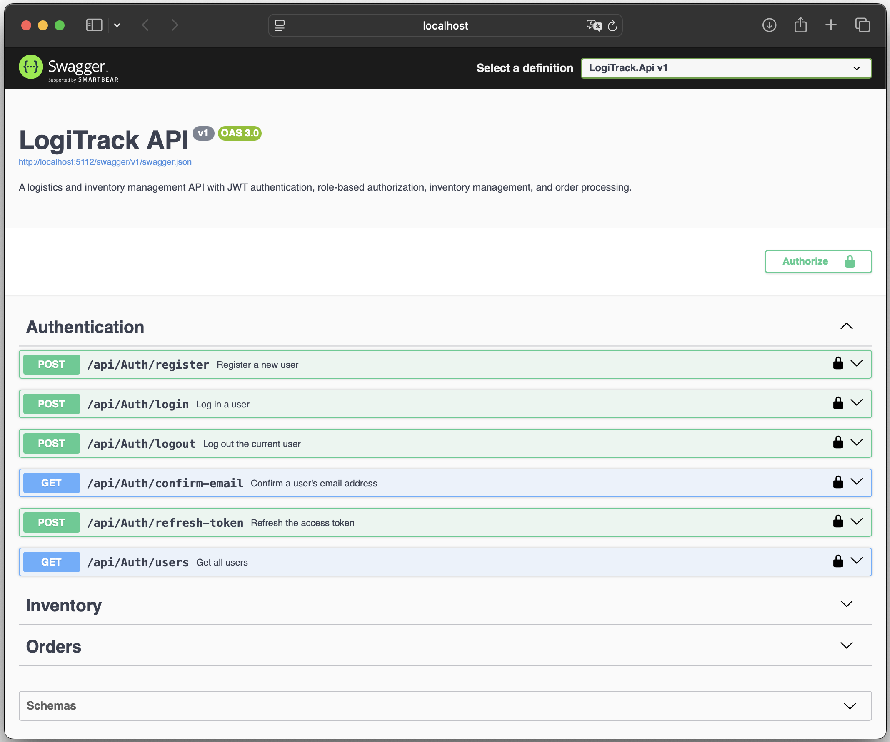
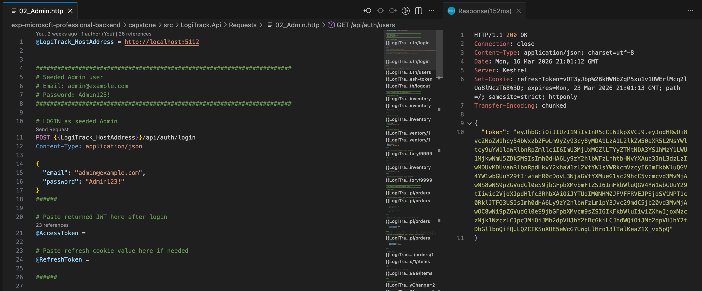
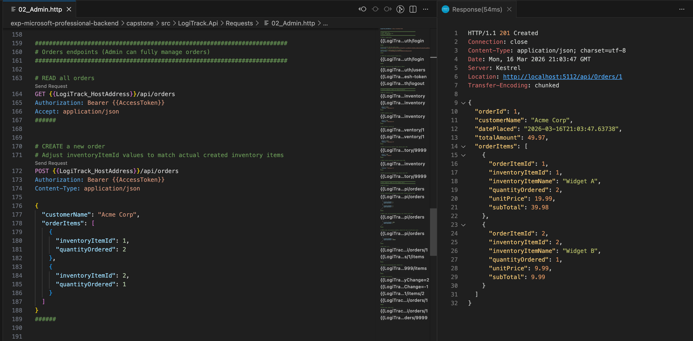
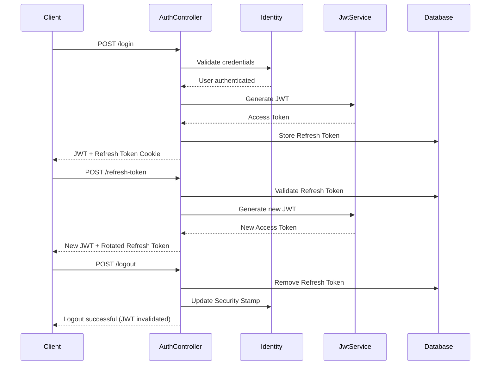

# LogiTrack - Secure Order & Inventory Management API

LogiTrack is a secure backend API built with ASP.NET Core Web API for managing warehouse inventory and customer orders in a logistics-style system. The project is designed to demonstrate clean architecture, secure authentication, role-based authorisation, domain-driven business logic, performance optimisation, Swagger-based API documentation, and automated testing in a production-style backend application.

---
## 📸 Screenshots / API Preview

### Swagger Endpoint Overview

Interactive API documentation showing available endpoint groups as well as the Auth endpoints.


### Admin Authentication Request

Example login request executed via the VS Code REST client returning a JWT access token.


### Create Order Request

Authenticated request via the VS Code REST client creating a new order using a JSON payload.



---
## 🚀 Running the Project

Within the Terminal, navigate to the `/LogiTrack.Api`directory and:

1. Restore dependencies: `dotnet restore`
2. Apply database migrations: `dotnet ef database update`
3. Start the local API Server: `dotnet run`
4. Test API endpoints via the `.http` files inside the `/Requests`directory
5. Go to `https://localhost:{port}/swagger` for Swagger UI + API documentation

Automated tests can be executed from the `/LogiTrack.Api.Tests` directory via: `dotnet test`

---
## 🧰 Technology Stack

- ASP.NET Core Web API
- Entity Framework Core + SQLite
- ASP.NET Core Identity
- JWT Bearer Authentication
- IMemoryCache
- Swagger / OpenAPI
- xUnit + FluentAssertions + Moq

---
## 🗃️ Project Structure 

```text
.
├──	src
│	└── LogiTrack.Api
│	    ├── Contracts
│	    │   ├── Auth
│	    │   ├── Inventory
│	    │   ├── Mapping
│	    │   └── Orders
│	    ├── Controllers
│	    ├── Data
│	    │   ├── Migrations
│	    │   └── Seed
│	    ├── Models
│	    ├── Requests
│	    └── Services
│	        ├── Auth
│	        ├── Caching
│	        ├── Email
│	        ├── Inventory
│	        └── Orders
└── tests
    └── LogiTrack.Api.Tests
        ├── Controllers
        ├── Data
        ├── Models
        └── Services
```

---
## 🏗 Architecture

The project follows a layered architecture:

```text
├── Controllers
├── Services (Business Logic)
├── Domain Models
├── Entity Framework Core / SQLite Database
```

### Controller Layer

- Responsible for HTTP request handling and response generation
- Main tasks include:
	- Validating incoming DTOs
	- Enforcing authorisation policies
	- Calling services for business logic
	- Translating service results into HTTP responses
	- Holding Swagger-OpenAPI metadata

### Service Layer

- Contains the main business logic of the application
- Responsibilities include:
	- Validating business rules
	- Coordinating database operations
	- Enforcing domain workflows
	- Handling cache invalidation
	- Generating JWT access tokens and rotating refresh tokens
	- Returning structured service results

### Domain Models Layer

- Domain entities encapsulate business logic and validation rules
- Examples of domain behaviour:
	- `InventoryItem.IncreaseStock()`
	- `InventoryItem.DecreaseStock()`
	- `Order.AddItem()`
	- `Order.RemoveItem()`
	- `OrderItem.UpdateQuantity()`
- This approach enforces valid state transitions and prevents inconsistent data manipulation

### Database Layer

- Data persistence is handled through **Entity Framework Core**.
- Key characteristics:
	- relational schema with explicit relationships
	- migrations for schema evolution
	- SQLite used for lightweight persistence
	- design-time DbContext factory for tooling

---
## 🔐 Security and Authentication

The LogiTrack API implements a secure authentication and authorisation system based on **ASP.NET Core Identity** and **JWT Bearer authentication**. Key aspects include:

- JWT access tokens for authenticated API access
- Refresh tokens stored securely per user
- HTTP-only cookies for refresh token transport
- Logout invalidates refresh tokens and updates the Identity security stamp
- Strong password policies and account lockout
- Email confirmation required before login
- DTO-based request/response protection
- Role-based access control implemented through **policy-based authorisation**

| Role           | Privileges           | Enforcing Policy                         |
| -------------- | -------------------- | ---------------------------------------- |
| Admin          | full system access   | `[Authorize(Policy = "AdminOnly")]`      |
| WarehouseStaff | inventory management | `[Authorize(Policy = "InventoryWrite")]` |
| SalesStaff     | order management     | `[Authorize(Policy = "OrderWrite")]`     |



---
## ⚡ Performance Optimisations

Performance optimisations implemented in the API include:

- `IMemoryCache` used for frequently accessed endpoints
- Sliding expiration strategy
- Explicit cache invalidation on mutations
- `AsNoTracking()` used for read-heavy queries
- Projection to DTOs reduces database tracking overhead
- Eager loading prevents N+1 query patterns

---
## 🧪 Integrated Testing

The project includes both **automated tests** and **manual request testing**. Automated tests cover:

- Domain model validation
- Service layer business workflows
- Controller response behaviour
- Authentication utilities

Manual API testing is supported through predefined `.http` requests located in the `/Requests` directory, allowing quick testing of authentication, inventory, and order workflows directly from the code editor.

---
## 📖 API Documentation

The API is fully documented using **Swagger / OpenAPI**. Features include:

- Grouped endpoints by domain
- Operation summaries and descriptions
- Route parameter documentation
- Response status definitions
- JWT authentication support within Swagger UI

Swagger UI is available at: `https://localhost:{port}/swagger`

---
## 🎯 What This Project Demonstrates

- Secure REST API design
- Clean separation of concerns
- Service-oriented application structure
- Policy-based RBAC implementation (`Admin`, `WarehouseStaff`, `SalesStaff`)
- Token-based session management
- Encapsulated business logic inside domain models
- Many-to-many relationship modelled via `OrderItem` junction entity
- In-memory caching with automatic invalidation
- Query optimisation using `AsNoTracking()` and projection
- Swagger/OpenAPI documentation
- Automated unit testing across multiple layers
- Production-style backend architecture